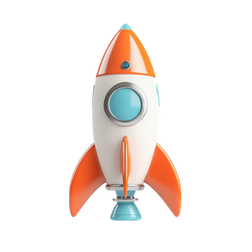
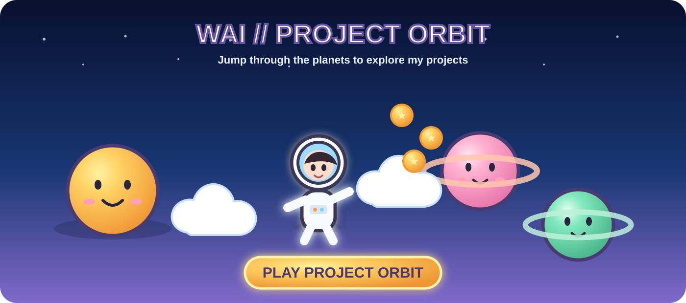
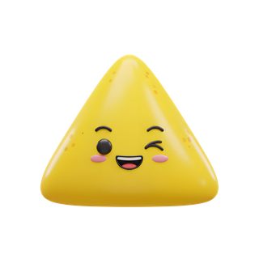
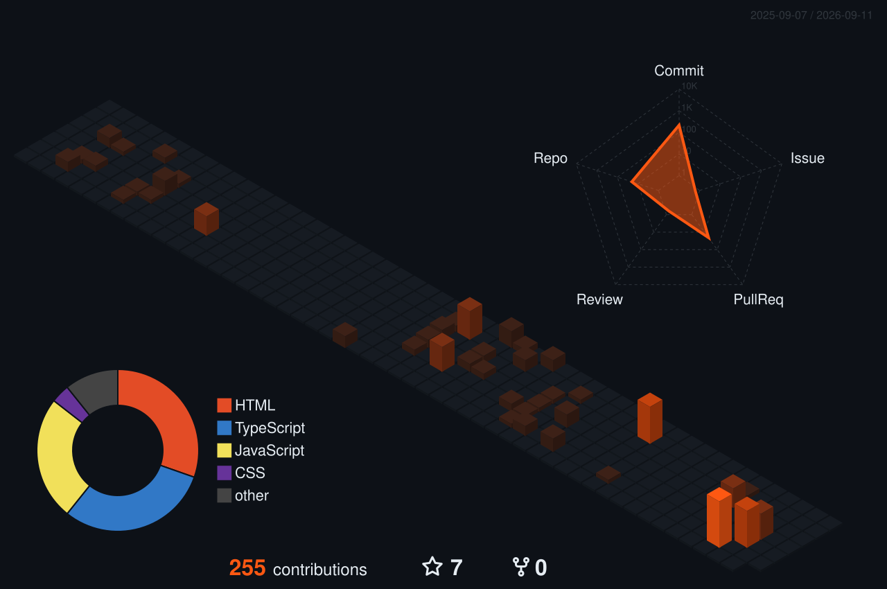

<h1>WADSSA WACEMBERG</h1>

`WAI // OBSERVER PROTOCOL`

  

##  WAI // PROJECT ORBIT

A CUTE CARTOON PLATFORM GAME THAT TURNS MY PROJECTS INTO PLANETS

 

  

<a href="https://wadssawacemberg.github.io/WadssaWacemberg/"> <b>PLAY PROJECT ORBIT</b></a>

### HOW TO PLAY

`01` Press `START`  
`02` Move with `A / D` or `← / →`  
`03` Jump through smiling clouds and project planets  
`04` Collect star coins and jump on the cute space creatures  
`05` Land on a project planet and press `E` or `ENTER`

PROJECT ORBIT IS THE FUN GATEWAY // W.AI OBSERVER 3D REMAINS THE MAIN IMMERSIVE EXPERIENCE

<a href="https://wadssawacemberg.github.io/WadssaWacemberg/"> <b>Project Orbit</b></a>
&nbsp;&nbsp;&nbsp;&nbsp;
<a href="https://wai-observer-3d-portfolio.wadssa.workers.dev/"> <b>3D Portfolio</b></a>
&nbsp;&nbsp;&nbsp;&nbsp;
<a href="https://wadssawacemberg.github.io/Landing-Page/en/"> <b>Portfolio</b></a>
&nbsp;&nbsp;&nbsp;&nbsp;
<a href="https://www.linkedin.com/in/wadssa-wacemberg"> <b>LinkedIn</b></a>
&nbsp;&nbsp;&nbsp;&nbsp;
<a href="https://github.com/WadssaWacemberg?tab=repositories"> <b>GitHub</b></a>

## ◈ OBSERVER // PROFILE

> I build technology that transforms complex systems into understandable experiences for the people technology usually forgets.

I'm a **Full Stack Developer and Computer Science student** building software across web applications, cloud infrastructure, intelligent systems and immersive 3D experiences.

My work combines engineering, interaction and human-centered technology — from APIs and distributed systems to real-time telemetry and WebGL/WebGPU environments.

## ◈ ORBITAL STACK

  

### CORE
TypeScript · JavaScript · Node.js · NestJS · React

### DATA
PostgreSQL · MySQL · Redis

### CLOUD
AWS · Docker · Cloudflare Workers · Render · Vercel

### IMMERSIVE
Three.js · WebGL · WebGPU · 3D Interaction

### INTELLIGENCE
Python · Machine Learning · Generative AI

##  ENGINEERING TELEMETRY

##  SIGNAL ACTIVITY

  

## ◈ 3D CONTRIBUTION FIELD

  

**WAI // OBSERVER**

`CODE • SYSTEMS • INTELLIGENCE • HUMAN EXPERIENCE`

